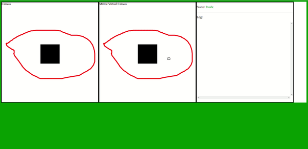

# pixel based hit detection

Sample of pixel based hit detection where we watch certain pixel to find out if its color has been changed

# How it works

    This is sample only to see if it works so no optimization
    is done. 'i am sorry'

Get image data of canvas and search for first breakpoint pixel whoose color is other then alpha and then store it somewhere, like this way we will store all pixels which have any other colors except alpha(breakpoint) and whenever and object moves
in canvas we check the pixel color of breakpoint and if the color of breakpoint is other than alpha then its hit detection.

# Demo

# Run

- Clone it
- `npm i`
- `npm start`

# helpful items

- http://www.drawsvg.org/drawsvg.html
- Fabricjs
